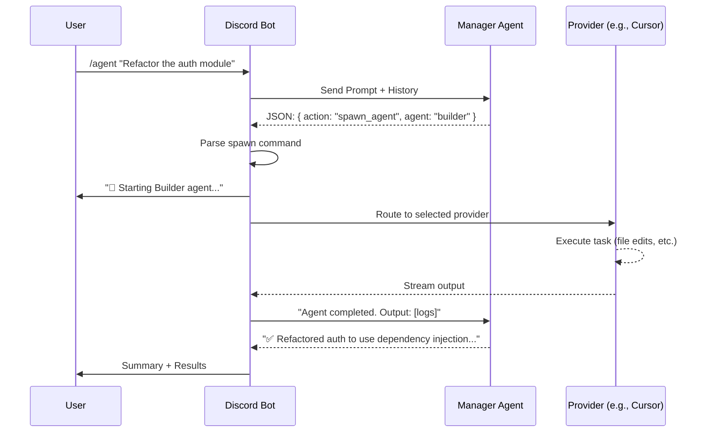

# one agent discord - Architecture Overview

## The One Agent Philosophy

**one agent discord** is a dynamic routing layer that connects Discord to any AI provider. Rather than being locked to a single AI backend, the system decouples the user interface (Discord) from the execution layer (providers), enabling:

- **Provider flexibility**: Switch between Cursor, Claude, Ollama, Gemini, or any provider
- **Model agnosticism**: Use the right model for each task
- **Role consistency**: Behavioral roles work across all providers
- **Graceful fallback**: Route to alternatives when providers are unavailable

---

## System Hierarchy

```
┌─────────────────────────────────────────────────────────────────────────────┐
│                              Discord Interface                               │
│                         (Slash Commands, Messages)                           │
└─────────────────────────────────┬───────────────────────────────────────────┘
                                  │
                                  ▼
┌─────────────────────────────────────────────────────────────────────────────┐
│                            one agent (Router)                                │
│                                                                              │
│  ┌────────────────────────────────────────────────────────────────────────┐ │
│  │                         Manager Agent                                   │ │
│  │  • Triages user requests                                               │ │
│  │  • Decomposes complex tasks                                            │ │
│  │  • Delegates to specialized roles                                      │ │
│  │  • Coordinates multi-agent workflows                                   │ │
│  └────────────────────────────────────────────────────────────────────────┘ │
│                                  │                                           │
│              ┌───────────────────┼───────────────────┐                      │
│              ▼                   ▼                   ▼                      │
│  ┌──────────────────┐ ┌──────────────────┐ ┌──────────────────┐            │
│  │   Builder Role   │ │   Tester Role    │ │  Architect Role  │  ...       │
│  │   (implements)   │ │   (validates)    │ │   (designs)      │            │
│  └────────┬─────────┘ └────────┬─────────┘ └────────┬─────────┘            │
│           │                    │                    │                       │
│           └────────────────────┴────────────────────┘                       │
│                                │                                            │
│  ┌────────────────────────────────────────────────────────────────────────┐ │
│  │                        Provider Layer                                   │ │
│  │                                                                         │ │
│  │  ┌─────────┐  ┌─────────┐  ┌─────────┐  ┌─────────┐  ┌─────────┐      │ │
│  │  │ Cursor  │  │ Claude  │  │ Ollama  │  │ Gemini  │  │ OpenAI  │      │ │
│  │  │Provider │  │Provider │  │Provider │  │Provider │  │Provider │      │ │
│  │  └─────────┘  └─────────┘  └─────────┘  └─────────┘  └─────────┘      │ │
│  └────────────────────────────────────────────────────────────────────────┘ │
└─────────────────────────────────────────────────────────────────────────────┘
```

---

## Core Components

### 1. Manager Agent (Orchestrator)

The Manager is the brain of the system. It receives user requests and decides how to handle them:

- **Role**: Frontend of the system; owns the user relationship
- **Model**: High-performance, low-latency (e.g., Gemini Flash)
- **Responsibilities**:
  - **Triage**: Decide if a request is simple (answer directly) or complex (delegate)
  - **Delegation**: Spawn specialized agents via `spawn_agent` action
  - **Coordination**: Pass context between agents, avoid redundant work
  - **Summarization**: Consolidate agent outputs for the user
  - **Memory**: Maintain conversation history for continuity

```typescript
// Manager decision flow
User Request → Parse Intent → 
  Simple? → Direct Response
  Complex? → Spawn Agent → Monitor → Summarize Results
```

### 2. Role System

Roles are behavioral presets that define *how* an agent approaches tasks. Roles are **provider-independent**—the same role works whether backed by Cursor, Claude, or Ollama.

| Role | Focus | Best For |
|------|-------|----------|
| **Builder** 🔨 | Implementation | Writing code, adding features |
| **Tester** 🧪 | Validation | Writing tests, QA, verification |
| **Investigator** 🔍 | Analysis | Debugging, security audits |
| **Architect** 🏗️ | Design | System planning, refactoring strategy |
| **Reviewer** 👁️ | Feedback | Code review, best practices |

Roles are defined in `.roles/*.md` files within your repository, allowing project-specific customization.

### 3. Provider Layer

Providers are pluggable backends that execute agent requests. Each provider implements a common interface:

```typescript
interface AgentProvider {
  sendMessage(prompt: string, options: ProviderOptions): Promise<AgentResponse>;
  streamMessage(prompt: string, options: ProviderOptions): AsyncIterable<string>;
  isAvailable(): Promise<boolean>;
}
```

**Available Providers:**

| Provider | Type | Strengths | Use Case |
|----------|------|-----------|----------|
| **Cursor** | CLI Process | File editing, autonomous coding | Refactoring, debugging |
| **Claude CLI** | CLI Process | Reasoning, code review | Architecture, analysis |
| **Ollama** | Local API | Privacy, offline, free | Experimentation, sensitive data |
| **Antigravity** | HTTP API | Fast, orchestration | Manager agent, quick queries |
| **OpenAI** | HTTP API | GPT models | Compatibility, specific needs |

### 4. Session Management

Sessions track the state of ongoing agent interactions:

```typescript
interface AgentSession {
  id: string;
  userId: string;
  channelId: string;
  agentName: string;
  client: 'cursor' | 'claude' | 'ollama' | 'antigravity';
  model: string;
  history: Message[];
  status: 'active' | 'paused' | 'completed';
}
```

**Multi-Agent Support:**
- Multiple agents can run simultaneously in the same channel
- Sessions are tracked by `userId:channelId` composite key
- The Manager can spawn multiple subagents without stopping existing ones

---

## Interaction Flow



---

## Adding a New Provider

1. **Create provider file** in `agent/providers/`:

```typescript
// agent/providers/my-provider.ts
import { AgentProvider, ProviderOptions, AgentResponse } from "../provider-interface.ts";

export class MyProvider implements AgentProvider {
  async sendMessage(prompt: string, options: ProviderOptions): Promise<AgentResponse> {
    // Implementation
  }

  async *streamMessage(prompt: string, options: ProviderOptions): AsyncIterable<string> {
    // Streaming implementation
  }

  async isAvailable(): Promise<boolean> {
    // Check if provider is configured and reachable
  }
}
```

2. **Register in provider index** (`agent/providers/index.ts`)

3. **Add to settings** in `data/settings.json`

---

## Directory Structure

```
agent/
├── manager.ts          # Manager system prompt and action parsing
├── index.ts            # Agent orchestration and session management
├── types.ts            # Agent configs, role definitions, session types
├── registry.ts         # Agent registry for available agents
├── providers/          # Provider implementations
│   ├── index.ts        # Provider registry and factory
│   ├── cursor-provider.ts
│   ├── ollama-provider.ts
│   ├── antigravity-provider.ts
│   └── ...
├── orchestrator.ts     # Multi-agent coordination
└── handlers.ts         # Discord command handlers

discord/
├── bot.ts              # Discord.js client setup
├── commands.ts         # Slash command definitions
├── message-handler.ts  # Message event handling
└── formatting.ts       # Rich embed formatting

settings/
├── unified-settings.ts # Settings management
└── provider-config.ts  # Provider-specific configuration

util/
├── swarm-manager.ts    # Multi-agent swarm coordination
└── ...
```

---

## Configuration

### Provider Priority

The system uses a priority-based provider selection:

```json
{
  "providers": {
    "default": "antigravity",
    "fallback": ["ollama", "claude-cli"],
    "routing": {
      "file-editing": "cursor",
      "reasoning": "claude-cli",
      "quick-query": "antigravity"
    }
  }
}
```

### Role-Provider Recommendations

| Role | Recommended Provider | Reason |
|------|---------------------|--------|
| Builder 🔨 | Cursor, Antigravity | File editing capabilities |
| Tester 🧪 | Any | Testing works everywhere |
| Investigator 🔍 | Ollama, Claude | Deep analysis needs power |
| Architect 🏗️ | Antigravity | Planning needs broad context |
| Reviewer 👁️ | Claude, Gemini | High-quality feedback |

---

## Security Model

### Isolation Layers

1. **Discord permissions**: Role-based command access
2. **Provider sandboxing**: Cursor supports `--sandbox enabled`
3. **Workspace restriction**: Agents operate within defined directories
4. **Approval gates**: High-risk operations require confirmation

### Risk Classification

| Risk Level | Examples | Behavior |
|------------|----------|----------|
| **Low** | Read-only queries, explanations | Execute immediately |
| **Medium** | Code generation, file reads | Execute with logging |
| **High** | File editing, shell commands | Require approval (configurable) |

---

## Performance Considerations

| Scenario | Recommended Approach |
|----------|---------------------|
| Simple Q&A | Use fast provider (Antigravity/Gemini Flash) |
| Complex reasoning | Use powerful provider (Claude/GPT-4) |
| File editing | Use specialized provider (Cursor) |
| Sensitive data | Use local provider (Ollama) |
| Cost optimization | Route by task complexity |

---

## Related Documentation

- [README.md](README.md) - Project overview and quick start
- [docs/AGENT-ROLE-SYSTEM.md](docs/AGENT-ROLE-SYSTEM.md) - Complete role system guide
- [docs/CURSOR_GUIDE.md](docs/CURSOR_GUIDE.md) - Cursor provider details
- [docs/DISCORD_COMMANDS.md](docs/DISCORD_COMMANDS.md) - Command reference
