# Architecture Overview

## The Manager-Subagent Pattern

The core philosophy of this refactor is to move away from a monolithic "chat with a model" loop to a **Hierarchical Agent System**.

### 1. The Main Agent (Manager)
*   **Role**: The frontend of the system. It owns the user relationship.
*   **Model**: `gemini-2.0-flash`. Selected for low latency and high instruction-following capability.
*   **Responsibilities**:
    *   **Triage**: Decide if a user request is a simple question or a complex task.
    *   **Delegation**: If a task is complex, it outputs a structured JSON command `spawn_agent`.
    *   **Summarization**: When a subagent finishes, the Manager reads the raw output and summarizes it for the user.
    *   **Memory**: Maintains the conversation history (`AgentSession.history`) to provide continuity.

### 2. Subagents
*   **Role**: Specialized workers. They do not talk to the user directly during execution.
*   **Examples**:
    *   `ag-coder`: Specialized in reading/writing code.
    *   `ag-architect`: Specialized in system design and planning.
*   **Execution**:
    *   Spawned by `runAgentTask`.
    *   Run "headlessly" (output is captured, not streamed to Discord directly).
    *   Return a final result string/object to the Manager.

### 3. Interaction Flow

```mermaid
sequenceDiagram
    participant U as User
    participant D as Discord Bot
    participant M as Manager (Gemini)
    participant S as Subagent (e.g. Coder)

    U->>D: "Refactor the login page"
    D->>M: Send Prompt + History
    M-->>D: JSON: { action: "spawn_agent", agent: "ag-coder" }
    D->>D: Identify Spawn Command
    D->>U: "🚧 Manager Delegating..." (Status Embed)
    D->>S: runAgentTask("Refactor login page")
    S-->>S: [Reads/Writes Files]
    S-->>D: Return Execution Output
    D->>M: "Subagent finished. Output: [logs]. Summarize this."
    M-->>D: "I updated the login page..."
    D->>U: "✅ Task Completed" (Summary Embed)
```

## Directory Structure

*   **`agent/`**:
    *   `manager.ts`: Manager system prompt and response parsing logic.
    *   `index.ts`: The "Kernel". Handles session state (`AgentSession`), history, and the `handleManagerInteraction` loop.
*   **`claude/`**:
    *   `antigravity-client.ts`: The unified client for talking to Gemini models.
