# Architecture Overview

## The Manager-Subagent Pattern

The core philosophy of this refactor is to move away from a monolithic "chat with a model" loop to a **Hierarchical Agent System**.

### 1. The Main Agent (Manager)

- **Role**: The frontend of the system. It owns the user relationship.
- **Model**: `gemini-3-flash`. Selected for low latency and high instruction-following capability.
- **Responsibilities**:
  - **Triage**: Decide if a user request is a simple question or a complex task.
  - **Delegation**: If a task is complex, it outputs a structured JSON command `spawn_agent`.
  - **Summarization**: When a subagent finishes, the Manager reads the raw output and summarizes it for the user.
  - **Memory**: Maintains the conversation history (`AgentSession.history`) to provide continuity.

### 2. Subagents

- **Role**: Specialized workers. They can work concurrently on different tasks.
- **Examples**:
  - `ag-coder`: Specialized in reading/writing code.
  - `ag-architect`: Specialized in system design and planning.
- **Execution**:
  - Spawned by `runAgentTask` or via Manager's `spawn_agent` action.
  - **Multi-Agent Support**: Multiple agents can run simultaneously in the same channel.
  - Each agent maintains its own session and can work on different tasks concurrently.
  - Agents are tracked per user+channel combination, allowing parallel execution.
  - Use `/agents-status` to view all active agents.

### 3. Interaction Flow

```mermaid
sequenceDiagram
    participant U as User
    participant D as Discord Bot
    participant M as Manager (Gemini)
    participant S as Subagent (e.g. Coder)

    U->>D: "Refactor the login page"
    D->>M: Send Prompt + History
    M-->>D: JSON: { action: "spawn_agent", agent: "ag-coder" }
    D->>D: Identify Spawn Command
    D->>U: "🚀 Spawning Agent..." (Status Embed)
    D->>S: runAgentTask("Refactor login page")
    Note over S: Agent runs concurrently with other agents
    S-->>S: [Reads/Writes Files]
    S-->>D: Return Execution Output
    D->>M: "Subagent finished. Output: [logs]. Summarize this."
    M-->>D: "I updated the login page..."
    D->>U: "✅ Task Completed" (Summary Embed)
```

## Multi-Agent Architecture

### Concurrent Agent Execution

The system now supports **multiple agents running simultaneously**:

- **Per-Channel Tracking**: Agents are tracked by `userId:channelId` composite key
- **Concurrent Sessions**: Multiple `AgentSession` objects can be active at once
- **Independent Execution**: Each agent maintains its own conversation history and state
- **Manager Coordination**: The Manager agent can spawn multiple subagents without stopping existing ones

### Category Naming

- **Repository Visibility**: Category names include repository information
- **Format**: `CategoryName (RepositoryName)` or just `RepositoryName`
- **Benefits**: Easy identification of which repository each Discord category belongs to
- **Commands**: Use `/category-info` and `/repo-info` to view details

## Directory Structure

- **`agent/`**:
  - `manager.ts`: Manager system prompt and response parsing logic.
  - `index.ts`: The "Kernel". Handles session state (`AgentSession`), history, multi-agent tracking, and the `handleManagerInteraction` loop.
  - `registry.ts`: Agent registry for managing available agents.
- **`claude/`**:
  - `antigravity-client.ts`: The unified client for talking to Gemini models.
- **`util/`**:
  - `handler.ts`: Utility handlers including `/agents-status`, `/category-info`, `/repo-info`.
