# 🤖 Agent Role System - Complete Guide

<div align="center">

**A flexible, provider-independent role system for AI agents**

*Route to any provider • Customize per repository • Consistent experience*

</div>

---

## 📚 Table of Contents

- [Overview](#overview)
- [The One Agent Philosophy](#the-one-agent-philosophy)
- [Architecture](#architecture)
- [Role System](#role-system)
- [Provider Integration](#provider-integration)
- [Workflow](#workflow)
- [Customization Guide](#customization-guide)
- [Troubleshooting](#troubleshooting)

---

## 🎯 Overview

The Agent Role System provides a flexible way to interact with AI agents using different providers (Cursor, Claude, Ollama, Gemini, etc.) while maintaining consistent, repository-specific role definitions.

### Key Concepts

```mermaid
graph TB
    A[🧑 User] -->|1. Request| B[🔀 one agent Router]
    B -->|2. Select| C[👔 Role]
    B -->|3. Route to| D[🔌 Provider]
    C -.->|Guides| E[🤖 Agent]
    D -.->|Powers| E
    E -->|4. Response| A
    
    F[📁 .roles/builder.md] -.->|Loaded into| C
    
    style A fill:#e1f5ff
    style B fill:#fff3e0
    style C fill:#f3e5f5
    style D fill:#e8f5e9
    style E fill:#fce4ec
    style F fill:#fff9c4
```



### 🎨 Design Philosophy

| Principle | Description |
|-----------|-------------|
| **Provider Independence** | Roles work with any AI provider |
| **Dynamic Routing** | Route requests to the best provider for the task |
| **Repository Context** | Role documents live in your repo |
| **Single Responsibility** | Each role has one clear focus |
| **Consistent Experience** | Same roles, any backend |

---

## 🧭 The One Agent Philosophy

**one agent** is not a specific AI model—it's a routing layer that connects your Discord interface to any AI provider. The role system is the behavioral layer on top of this:

```
┌──────────────────────────────────────────────────────────────┐
│                     User Request                              │
│              "Refactor the auth module"                       │
└─────────────────────────┬────────────────────────────────────┘
                          │
                          ▼
┌──────────────────────────────────────────────────────────────┐
│                    one agent Router                           │
│                                                               │
│  1. Parse intent → "refactoring task"                        │
│  2. Select role → Builder 🔨                                  │
│  3. Route to provider → Cursor (file editing)                │
└─────────────────────────┬────────────────────────────────────┘
                          │
                          ▼
┌──────────────────────────────────────────────────────────────┐
│              Builder Role + Cursor Provider                   │
│                                                               │
│  Role: "Focus on clean implementation..."                    │
│  Provider: Cursor CLI with file editing                      │
└──────────────────────────────────────────────────────────────┘
```

**Why this matters:**
- Switch providers without learning new commands
- Same role definitions work across all providers
- Optimize cost by routing to the right provider

---

## 🏗️ Architecture

### System Components

```mermaid
graph LR
    subgraph "Discord Interface"
        A[/agent Command]
    end
    
    subgraph "one agent Core"
        B[Router]
        C[Role System]
        D[Session Manager]
    end
    
    subgraph "Providers"
        E[Cursor]
        F[Claude]
        G[Ollama]
        H[Gemini]
    end
    
    A --> B
    B --> C
    C --> D
    D --> E & F & G & H
    
    style A fill:#4fc3f7
    style B fill:#ffb74d
    style C fill:#ba68c8
    style D fill:#81c784
```

### Data Flow


---

## 👔 Role System

### Available Roles

| Role | Emoji | Focus | Best For |
|------|-------|-------|----------|
| **Builder** | 🔨 | Implementation | Writing code, adding features |
| **Tester** | 🧪 | Validation | Writing tests, QA |
| **Investigator** | 🔍 | Analysis | Debugging, security audits |
| **Architect** | 🏗️ | Design | System planning, refactoring |
| **Reviewer** | 👁️ | Feedback | Code review, best practices |

### Role Definition Structure

Each role is defined in code and optionally extended with a markdown document:

```typescript
interface RoleDefinition {
  name: string;              // Display name (e.g., "Builder")
  description: string;       // Short description
  emoji: string;             // Visual identifier (e.g., "🔨")
  documentPath: string;      // Path to role doc (.roles/builder.md)
  systemPromptAddition: string; // Fallback prompt if file missing
}
```

### Role Documents

Store role definitions in your repository's `.roles/` directory:

```markdown
<!-- .roles/builder.md -->
# Builder Role

## Purpose
Implement features and write clean, maintainable code.

## Responsibilities
- Write production-quality code
- Follow project conventions
- Add appropriate tests
- Document changes

## Best Practices
- Keep functions small and focused
- Use meaningful variable names
- Handle edge cases
```

The system automatically loads these documents to provide context to the AI.

### Role Comparison

| Feature | Builder 🔨 | Tester 🧪 | Investigator 🔍 | Architect 🏗️ | Reviewer 👁️ |
|---------|-----------|-----------|-----------------|--------------|-------------|
| **Primary Focus** | Implementation | Quality | Analysis | Design | Feedback |
| **Key Activities** | Write code | Write tests | Debug/audit | Plan systems | Review PRs |
| **Output** | Features | Test suites | Reports | Designs | Comments |
| **Mindset** | "How to build" | "Does it work?" | "Why broke?" | "Best structure?" | "How improve?" |
| **Risk Level** | Medium | Low | Low | Low | Low |

---

## 🔌 Provider Integration

### Provider Independence

Roles work with **any** provider. The role defines *what* to do; the provider determines *how* it's executed:

```mermaid
graph TB
    subgraph "Role Layer (What)"
        R1[Builder 🔨]
        R2[Tester 🧪]
        R3[Architect 🏗️]
    end
    
    subgraph "Provider Layer (How)"
        P1[Cursor - File editing]
        P2[Claude - Reasoning]
        P3[Ollama - Local/Private]
        P4[Gemini - Fast]
    end
    
    R1 -.-> P1 & P2 & P3 & P4
    R2 -.-> P1 & P2 & P3 & P4
    R3 -.-> P1 & P2 & P3 & P4
```



### Provider Comparison

| Provider | Type | Strengths | Best For |
|----------|------|-----------|----------|
| **Cursor** | CLI | File editing, autonomous | Builder, Refactoring |
| **Claude** | CLI/API | Reasoning, analysis | Architect, Reviewer |
| **Ollama** | Local | Privacy, offline, free | Sensitive data |
| **Gemini** | API | Fast, low latency | Quick queries, Manager |

### Recommended Pairings

| Role | Recommended Provider | Reason |
|------|---------------------|--------|
| Builder 🔨 | Cursor, Antigravity | File editing capabilities |
| Tester 🧪 | Any | Testing works everywhere |
| Investigator 🔍 | Ollama, Claude | Deep analysis |
| Architect 🏗️ | Antigravity, Claude | Broad context window |
| Reviewer 👁️ | Claude, Gemini | High-quality feedback |

---

## 🔄 Workflow

### Complete User Journey

```mermaid
stateDiagram-v2
    [*] --> RequestReceived: User sends /agent
    
    RequestReceived --> ParseIntent: Router parses request
    
    ParseIntent --> SelectRole: Determine role
    note right of SelectRole
        Choose from:
        - Builder 🔨
        - Tester 🧪
        - Investigator 🔍
        - Architect 🏗️
        - Reviewer 👁️
    end note
    
    SelectRole --> LoadRole: Load role context
    note right of LoadRole
        Loads from:
        .roles/{role}.md
        Falls back to built-in
    end note
    
    LoadRole --> RouteProvider: Select provider
    note right of RouteProvider
        Auto-select or user-specified:
        - Cursor
        - Claude
        - Ollama
        - Gemini
    end note
    
    RouteProvider --> Execute: Agent processes
    Execute --> StreamResponse: Stream to Discord
    StreamResponse --> [*]: Complete
```



### Decision Tree

```mermaid
graph TD
    Start([User Request]) --> Task{What type of task?}
    
    Task -->|Build features| Builder[🔨 Builder]
    Task -->|Write tests| Tester[🧪 Tester]
    Task -->|Debug issues| Investigator[🔍 Investigator]
    Task -->|Design systems| Architect[🏗️ Architect]
    Task -->|Review code| Reviewer[👁️ Reviewer]
    
    Builder & Tester & Investigator & Architect & Reviewer --> Provider{Which provider?}
    
    Provider -->|File editing needed| Cursor[Cursor]
    Provider -->|Reasoning needed| Claude[Claude]
    Provider -->|Privacy needed| Ollama[Ollama]
    Provider -->|Speed needed| Gemini[Gemini]
    
    Cursor & Claude & Ollama & Gemini --> Execute([Execute Task])
    
    style Start fill:#e3f2fd
    style Execute fill:#c8e6c9
```



---

## 🎨 Customization Guide

### Adding a Custom Role

1. **Create Role Document**:

```markdown
<!-- .roles/devops.md -->
# DevOps Role

## Purpose
Deploy, monitor, and maintain production systems.

## Responsibilities
- Manage deployments
- Monitor system health
- Handle incidents
- Optimize infrastructure
```

2. **Add to Role Definitions** (`agent/types.ts`):

```typescript
'devops': {
  name: 'DevOps',
  description: 'Deploy, monitor, and maintain systems',
  emoji: '🚀',
  documentPath: '.roles/devops.md',
  systemPromptAddition: `
    **Role: DevOps**
    Focus on deployment, monitoring, and operations.
    Prioritize reliability and observability.
  `
}
```

3. **Update Menus** (if using selection UI):

```typescript
{ 
  label: '🚀 DevOps', 
  description: 'Deploy and maintain systems', 
  value: 'devops' 
}
```

### Customizing Existing Roles

To customize a role for your team:

1. Create/edit `.roles/{role}.md` in your repository
2. Add team-specific guidelines, examples, and conventions
3. The system automatically loads your custom version

---

## 🐛 Troubleshooting

### Common Issues

| Issue | Cause | Solution |
|-------|-------|----------|
| `Ollama server is not running` | Ollama not started | Run `ollama serve` |
| `No Ollama models available` | No models pulled | Run `ollama pull llama3.2` |
| `Cursor CLI error` | Auth issue | Check `cursor agent --version` |
| `Role not loading` | File missing | Check `.roles/` directory |
| `Provider not found` | Not configured | Add to settings |

### Debug Checklist

1. ✅ Provider running and accessible?
2. ✅ Model available for the provider?
3. ✅ Role file exists (or fallback available)?
4. ✅ Session active in correct channel?
5. ✅ Discord bot has required permissions?

---

## 📊 Quick Reference

### Commands

| Command | Purpose |
|---------|---------|
| `/agent action:chat` | Chat with agent using role |
| `/agent action:list` | List available roles |
| `/agent action:start` | Start session with role |
| `/agent action:end` | End current session |

### File Locations

| Path | Purpose |
|------|---------|
| `.roles/*.md` | Role document definitions |
| `agent/types.ts` | Role configurations |
| `agent/providers/` | Provider implementations |
| `data/settings.json` | Provider settings |

---

## 🚀 Best Practices

1. **Choose the Right Role**: Match the role to the task type
2. **Customize for Your Team**: Add project-specific role documents
3. **Use Provider Routing**: Mention providers for specific capabilities
4. **Start Sessions**: Use `/agent action:start` for ongoing work
5. **Monitor Active Agents**: Use `/agents-status` to track work

---

<div align="center">

**Part of the one agent ecosystem**

*Route to any AI. Work from anywhere.*

[Report Issue](../../issues) • [Request Feature](../../issues) • [View Source](../../)

</div>
