# 🤖 Agent Role System - Complete Guide

<div align="center">

**A flexible, repository-based role system for AI agents**

*Provider-independent • Repository-specific • Fully customizable*

</div>

---

## 📚 Table of Contents

- [Overview](#overview)
- [Architecture](#architecture)
- [Workflow](#workflow)
- [Role System](#role-system)
- [Provider Integration](#provider-integration)
- [Technical Details](#technical-details)
- [Customization Guide](#customization-guide)
- [Troubleshooting](#troubleshooting)

---

## 🎯 Overview

The Agent Role System provides a flexible way to interact with AI agents using different providers (Cursor, Claude, Ollama, etc.) while maintaining consistent, repository-specific role definitions.

### Key Concepts

```mermaid
graph TB
    A[🧑 User] -->|1. Selects| B[🔧 Provider]
    A -->|2. Selects| C[👔 Role]
    A -->|3. Selects| D[🎯 Model]
    B -.->|Powers| E[🤖 Agent]
    C -.->|Guides| E
    D -.->|Runs on| E
    E -->|4. Chats with| A
    
    F[📁 .roles/builder.md] -.->|Loaded into| C
    F -.->|Context for| E
    
    style A fill:#e1f5ff
    style B fill:#fff3e0
    style C fill:#f3e5f5
    style D fill:#e8f5e9
    style E fill:#fce4ec
    style F fill:#fff9c4
```



### 🎨 Design Philosophy

| Principle | Description |
|-----------|-------------|
| **Provider Independence** | Roles work with any AI provider |
| **Repository Context** | Role documents live in your repo |
| **Single Responsibility** | Each role has one clear focus |
| **Customizable** | Easy to modify for your team |
| **Consistent** | Same experience across providers |

---

## 🏗️ Architecture

### System Components

```mermaid
graph LR
    subgraph "Discord Interface"
        A[/run-adv Command]
    end
    
    subgraph "Selection Flow"
        B[Provider Menu]
        C[Role Menu]
        D[Model Menu]
    end
    
    subgraph "Agent System"
        E[Agent Config]
        F[Role Document]
        G[System Prompt]
    end
    
    subgraph "AI Providers"
        H[Cursor]
        I[Claude CLI]
        J[Ollama]
        K[Antigravity]
        L[Gemini API]
    end
    
    A --> B
    B --> C
    C --> D
    D --> E
    F -.->|Loaded into| G
    E --> G
    G --> H & I & J & K & L
    
    style A fill:#4fc3f7
    style B fill:#ffb74d
    style C fill:#ba68c8
    style D fill:#81c784
    style E fill:#e57373
    style F fill:#fff176
    style G fill:#64b5f6
```

### Data Flow


---

## 🔄 Workflow

### Complete User Journey

```mermaid
stateDiagram-v2
    [*] --> CommandIssued: User types /run-adv
    
    CommandIssued --> ProviderSelection: Show provider menu
    
    ProviderSelection --> RoleSelection: Provider chosen
    note right of ProviderSelection
        Choose from:
        - Cursor 💻
        - Claude CLI 🤖
        - Ollama 🦙
        - Antigravity ⚡
        - Gemini API 🚀
    end note
    
    RoleSelection --> LoadRoleDoc: Role chosen
    note right of RoleSelection
        Choose from:
        - Builder 🔨
        - Tester 🧪
        - Investigator 🔍
        - Architect 🏗️
        - Reviewer 👁️
    end note
    
    LoadRoleDoc --> ModelSelection: Role doc loaded
    note right of LoadRoleDoc
        Loads from:
        .roles/{role}.md
        Falls back to built-in
    end note
    
    ModelSelection --> SessionCreated: Model chosen/auto-selected
    note right of ModelSelection
        Provider-specific models
        OR auto-select best
    end note
    
    SessionCreated --> Active: Agent initialized
    note right of SessionCreated
        - Provider configured
        - Role injected
        - Model set
        - Session active
    end note
    
    Active --> Chatting: Ready for messages
    Active --> [*]: /kill command
    
    Chatting --> Chatting: User messages
    Chatting --> [*]: Session ended
```



### Decision Tree

```mermaid
graph TD
    Start([User wants AI help]) --> Command{Use /run-adv}
    
    Command -->|Step 1| Provider{What provider?}
    Provider -->|Local/Fast| Ollama[🦙 Ollama<br/>Free, runs locally]
    Provider -->|IDE Integration| Cursor[💻 Cursor<br/>Built into editor]
    Provider -->|Anthropic| Claude[🤖 Claude CLI<br/>Official API]
    Provider -->|Google AI| Gemini[🚀 Gemini/Antigravity<br/>Powerful, fast]
    
    Ollama & Cursor & Claude & Gemini --> Role{What's your task?}
    
    Role -->|Build features| Builder[🔨 Builder<br/>Implementation focused]
    Role -->|Test code| Tester[🧪 Tester<br/>Quality assurance]
    Role -->|Debug/Secure| Investigator[🔍 Investigator<br/>Analysis focused]
    Role -->|Design systems| Architect[🏗️ Architect<br/>High-level planning]
    Role -->|Review code| Reviewer[👁️ Reviewer<br/>Feedback focused]
    
    Builder & Tester & Investigator & Architect & Reviewer --> Model{Choose model}
    
    Model -->|Specific| SelectModel[Pick from list]
    Model -->|Let system decide| AutoSelect[✨ Auto-select]
    
    SelectModel & AutoSelect --> Ready([🤖 Agent Ready!])
    
    style Start fill:#e3f2fd
    style Ready fill:#c8e6c9
    style Command fill:#fff3e0
    style Provider fill:#fce4ec
    style Role fill:#f3e5f5
    style Model fill:#e1f5fe
```



---

## 👔 Role System

### Role Architecture

```mermaid
graph TB
    subgraph "Role Definition (Code)"
        A[Role ID<br/>e.g., 'builder']
        B[Name & Emoji<br/>🔨 Builder]
        C[Description<br/>Short summary]
        D[Document Path<br/>.roles/builder.md]
        E[System Prompt Addition<br/>Fallback text]
    end
    
    subgraph "Role Document (File)"
        F[Purpose Section<br/>What this role does]
        G[Responsibilities<br/>Key duties]
        H[Best Practices<br/>Guidelines]
        I[Checklists<br/>Verification steps]
        J[Templates<br/>Useful formats]
    end
    
    subgraph "Runtime"
        K[Agent Session]
        L[Combined System Prompt]
    end
    
    A & B & C & D & E -.-> K
    D -->|Load from disk| F & G & H & I & J
    F & G & H & I & J -->|Inject into| L
    E -.->|Fallback if file<br/>doesn't exist| L
    K --> L
    
    style A fill:#ffebee
    style B fill:#e3f2fd
    style C fill:#f3e5f5
    style D fill:#fff9c4
    style E fill:#e0f2f1
    style F fill:#fce4ec
    style K fill:#c5e1a5
    style L fill:#b2dfdb
```



### Role Lifecycle

```mermaid
sequenceDiagram
    autonumber
    participant User
    participant Menu as Role Menu
    participant Code as Agent Code
    participant FS as File System
    participant Agent as AI Agent
    
    User->>Menu: Select "Builder" role
    Menu->>Code: role = 'builder'
    Code->>Code: Lookup ROLE_DEFINITIONS['builder']
    Note over Code: Gets documentPath:<br/>.roles/builder.md
    
    Code->>FS: readTextFile('.roles/builder.md')
    
    alt File exists
        FS-->>Code: Full role document
        Code->>Code: Inject document into system prompt
    else File missing
        FS-->>Code: File not found
        Code->>Code: Use systemPromptAddition fallback
    end
    
    Code->>Agent: Initialize with enriched prompt
    Note over Agent: Agent has Builder context<br/>and understands its role
    
    Agent-->>User: Ready with Builder mindset! 🔨
```



### Role Comparison Matrix

| Feature | Builder 🔨 | Tester 🧪 | Investigator 🔍 | Architect 🏗️ | Reviewer 👁️ |
|---------|-----------|-----------|-----------------|--------------|-------------|
| **Primary Focus** | Implementation | Quality | Analysis | Design | Feedback |
| **Key Activities** | Write code | Write tests | Debug/audit | Plan systems | Review PRs |
| **Output** | Features | Test suites | Reports | Designs | Comments |
| **Mindset** | "How to build" | "Does it work?" | "Why broke?" | "Best structure?" | "How improve?" |
| **Risk Level** | Medium | Low | Low | Low | Low |
| **Best With** | Cursor, Antigravity | All providers | Ollama, Claude | Antigravity | All providers |

---

## 🔌 Provider Integration

### Provider Comparison


### Provider-Client Mapping


### Provider Selection Logic

```mermaid
flowchart TD
    Start([Provider Selected]) --> Map{Map to Client Type}
    
    Map -->|ollama| CheckOllama{Ollama Running?}
    Map -->|cursor| CheckCursor{Cursor Installed?}
    Map -->|claude-cli| CheckClaude{Claude Authenticated?}
    Map -->|antigravity<br/>gemini-api| CheckGemini{API Key Set?}
    
    CheckOllama -->|Yes| LoadOllama[Load OllamaProvider]
    CheckOllama -->|No| ErrorOllama[❌ Start Ollama server]
    
    CheckCursor -->|Yes| LoadCursor[Load CursorProvider]
    CheckCursor -->|No| ErrorCursor[❌ Install Cursor CLI]
    
    CheckClaude -->|Yes| LoadClaude[Load ClaudeProvider]
    CheckClaude -->|No| ErrorClaude[❌ Run 'claude login']
    
    CheckGemini -->|Yes| LoadGemini[Load AntigravityProvider]
    CheckGemini -->|No| ErrorGemini[❌ Set API key]
    
    LoadOllama & LoadCursor & LoadClaude & LoadGemini --> Ready([✅ Provider Ready])
    
    ErrorOllama & ErrorCursor & ErrorClaude & ErrorGemini --> Failed([❌ Setup Required])
    
    style Start fill:#e3f2fd
    style Ready fill:#c8e6c9
    style Failed fill:#ffcdd2
```



---

## 🔧 Technical Details

### Agent Configuration Structure

```typescript
interface AgentConfig {
  name: string;              // Display name
  description: string;       // Short description
  model: string;            // AI model identifier
  systemPrompt: string;     // Base instructions
  temperature: number;      // Creativity level (0-1)
  maxTokens: number;       // Response length limit
  capabilities: string[];   // What it can do
  riskLevel: 'low' | 'medium' | 'high';
  client?: 'claude' | 'cursor' | 'antigravity' | 'ollama';
  workspace?: string;       // Working directory
  force?: boolean;         // Auto-approve ops
  sandbox?: 'enabled' | 'disabled';
  isManager?: boolean;     // Can spawn other agents
}
```

### Role Definition Structure

```typescript
interface RoleDefinition {
  name: string;              // Display name (e.g., "Builder")
  description: string;       // Short description
  emoji: string;            // Visual identifier (e.g., "🔨")
  documentPath: string;     // Path to role doc
  systemPromptAddition: string; // Fallback prompt
}
```

### Code Flow Diagram


### Session Management


---

## 🎨 Customization Guide

### Adding a Custom Role


### Step-by-Step: Adding "DevOps" Role

#### Step 1: Create Role Document

```markdown
<!-- .roles/devops.md -->
# DevOps Role

## Purpose
Deploy, monitor, and maintain production systems.

## Responsibilities
- Manage deployments
- Monitor system health
- Handle incidents
...
```

#### Step 2: Add to Code

```typescript
// agent/index.ts - Add to ROLE_DEFINITIONS
'devops': {
  name: 'DevOps',
  description: 'Deploy, monitor, and maintain systems',
  emoji: '🚀',
  documentPath: '.roles/devops.md',
  systemPromptAddition: `
    **Role: DevOps**
    Focus on deployment, monitoring, and operations...
  `
}
```

#### Step 3: Update Menu

```typescript
// discord/bot.ts - Add to role menu
.addOptions([
  // ... existing roles ...
  { 
    label: '🚀 DevOps', 
    description: 'Deploy, monitor, and maintain systems', 
    value: 'devops' 
  }
])
```

### Customizing Existing Roles

```mermaid
flowchart LR
    A[Identify Role<br/>to Customize] --> B{What to Change?}
    
    B -->|Content| C[Edit .roles/{role}.md]
    B -->|Behavior| D[Edit systemPromptAddition]
    B -->|Appearance| E[Edit emoji/description]
    
    C --> F[Add team-specific<br/>guidelines]
    C --> G[Add project<br/>examples]
    C --> H[Link to<br/>internal docs]
    
    D --> I[Adjust AI<br/>instructions]
    
    E --> J[Update<br/>visual identity]
    
    F & G & H & I & J --> K([✅ Custom Role Ready])
    
    style A fill:#e3f2fd
    style K fill:#c8e6c9
```

---

## 🐛 Troubleshooting

### Common Issues

```mermaid
graph TD
    Issue{What's Wrong?}
    
    Issue -->|Ollama Error| O1{Is Ollama running?}
    Issue -->|Cursor Error| C1{Is Cursor installed?}
    Issue -->|Role Not Loading| R1{Does file exist?}
    Issue -->|Wrong Context| M1{Model appropriate?}
    
    O1 -->|No| O2[Run: ollama serve]
    O1 -->|Yes| O3[Check: ollama list]
    
    C1 -->|No| C2[Install Cursor CLI]
    C1 -->|Yes| C3[Check: cursor --version]
    
    R1 -->|No| R2[Create .roles/{role}.md]
    R1 -->|Yes| R3[Check file permissions]
    
    M1 -->|Small model| M2[Try larger model<br/>or different provider]
    M1 -->|Wrong provider| M3[Switch to better provider]
    
    O2 & C2 & R2 & M2 --> Try[Try Again]
    O3 & C3 & R3 & M3 --> Debug[Check logs]
    
    style Issue fill:#fff3e0
    style Try fill:#c8e6c9
    style Debug fill:#e1f5fe
```

### Error Messages

| Error | Cause | Solution |
|-------|-------|----------|
| `Ollama server is not running` | Ollama not started | Run `ollama serve` |
| `No Ollama models available` | No models pulled | Run `ollama pull llama3.2` |
| `Cursor CLI encountered an error` | Cursor auth issue | Check Cursor login |
| `Could not read .roles/builder.md` | File missing | Role file doesn't exist (will use fallback) |
| `Provider not found` | Invalid provider | Select from available providers |

### Debug Checklist


---

## 📊 Performance Considerations

### Provider Performance Matrix

```mermaid
graph TB
    subgraph "Speed vs Quality"
        Fast[⚡ Fast Response]
        Quality[🎯 High Quality]
        
        Fast -.-> Ollama[Ollama<br/>Local, fast]
        Fast -.-> Gemini[Gemini Flash<br/>Cloud, fast]
        
        Quality -.-> Claude[Claude Sonnet<br/>High quality]
        Quality -.-> Cursor[Cursor<br/>IDE integration]
    end
    
    subgraph "Cost vs Access"
        Free[💰 Free/Low Cost]
        Premium[💎 Premium]
        
        Free -.-> Ollama
        Free -.-> Gemini
        
        Premium -.-> Claude
        Premium -.-> Cursor
    end
    
    style Fast fill:#c8e6c9
    style Quality fill:#b2dfdb
    style Free fill:#fff9c4
    style Premium fill:#ffccbc
```



### Role-Provider Recommendations

| Role | Best Provider | Why |
|------|--------------|-----|
| Builder 🔨 | Cursor, Antigravity | File editing capabilities |
| Tester 🧪 | Any | Testing works everywhere |
| Investigator 🔍 | Ollama, Claude | Deep analysis needs power |
| Architect 🏗️ | Antigravity | Planning needs broad context |
| Reviewer 👁️ | Claude, Gemini | High-quality feedback |

---

## 🎓 Best Practices

### Do's and Don'ts


### Role Selection Guide

```mermaid
graph TD
    Start{What's your goal?}
    
    Start -->|Write new code| Builder[👉 Builder Role]
    Start -->|Fix bugs| Debug{Find or fix?}
    Start -->|Improve code| Improve{What aspect?}
    Start -->|Plan feature| Plan{Design or implement?}
    Start -->|Other| Other{What else?}
    
    Debug -->|Find root cause| Investigator[👉 Investigator Role]
    Debug -->|Write fix| Builder
    
    Improve -->|Better design| Architect[👉 Architect Role]
    Improve -->|Better quality| Reviewer[👉 Reviewer Role]
    Improve -->|More tests| Tester[👉 Tester Role]
    
    Plan -->|High-level design| Architect
    Plan -->|Implementation| Builder
    
    Other -->|Code review| Reviewer
    Other -->|Testing| Tester
    Other -->|Investigation| Investigator
    
    style Builder fill:#c8e6c9
    style Investigator fill:#b2dfdb
    style Architect fill:#c5e1a5
    style Reviewer fill:#dce775
    style Tester fill:#fff59d
```



---

## 🚀 Quick Start Examples

### Example 1: Building a Feature

```mermaid
sequenceDiagram
    participant Dev as Developer
    participant Bot as Discord Bot
    participant Agent as AI Agent (Builder)
    
    Dev->>Bot: /run-adv
    Bot->>Dev: Show provider menu
    Dev->>Bot: Select "Cursor"
    Bot->>Dev: Show role menu
    Dev->>Bot: Select "Builder 🔨"
    Bot->>Dev: Show model menu
    Dev->>Bot: Click "Auto-select"
    
    Bot->>Agent: Initialize Builder with Cursor
    Note over Agent: Loaded .roles/builder.md<br/>Focus: Implementation
    
    Agent->>Dev: Ready! What feature?
    Dev->>Agent: "Add user authentication"
    
    Agent->>Agent: Think as Builder:<br/>- Plan implementation<br/>- Write clean code<br/>- Add tests
    
    Agent->>Dev: Here's the implementation plan...<br/>[Detailed code and steps]
```



### Example 2: Debugging an Issue

```mermaid
sequenceDiagram
    participant Dev as Developer
    participant Bot as Discord Bot
    participant Agent as AI Agent (Investigator)
    
    Dev->>Bot: /run-adv
    Note over Dev,Bot: Selects Ollama + Investigator
    
    Bot->>Agent: Initialize Investigator
    Note over Agent: Loaded .roles/investigator.md<br/>Focus: Analysis & Security
    
    Dev->>Agent: "App crashes on login"
    
    Agent->>Agent: Think as Investigator:<br/>- Gather information<br/>- Form hypotheses<br/>- Test systematically
    
    Agent->>Dev: Questions:<br/>1. What's the error message?<br/>2. When did it start?<br/>3. Can you share logs?
    
    Dev->>Agent: [Provides details]
    
    Agent->>Dev: Root cause: Null check missing<br/>Here's the fix...
```

### Example 3: Code Review

```mermaid
sequenceDiagram
    participant Dev as Developer
    participant Bot as Discord Bot
    participant Agent as AI Agent (Reviewer)
    
    Dev->>Bot: /run-adv
    Note over Dev,Bot: Selects Gemini + Reviewer
    
    Bot->>Agent: Initialize Reviewer
    Note over Agent: Loaded .roles/reviewer.md<br/>Focus: Constructive Feedback
    
    Dev->>Agent: Review this PR:<br/>[Code snippet]
    
    Agent->>Agent: Think as Reviewer:<br/>- Check quality<br/>- Find issues<br/>- Give feedback
    
    Agent->>Dev: Review feedback:<br/><br/>✅ Good: Clear naming<br/>🟡 Suggestion: Extract to function<br/>🔴 Issue: Security concern
```

---

## 📈 Metrics & Monitoring

### Session Metrics

```mermaid
pie title Agent Usage by Role (Example)
    "Builder" : 45
    "Investigator" : 25
    "Reviewer" : 15
    "Tester" : 10
    "Architect" : 5
```

### Provider Distribution

```mermaid
pie title Provider Usage (Example)
    "Cursor" : 35
    "Ollama" : 30
    "Antigravity" : 20
    "Claude CLI" : 10
    "Gemini API" : 5
```

---

## 🔮 Future Enhancements

```mermaid
timeline
    title Roadmap
    
    section Phase 1 (Current)
        Provider Integration : Cursor : Claude : Ollama : Antigravity : Gemini
        Role System : 5 Roles : File-based : Customizable
    
    section Phase 2 (Planned)
        Multi-Agent : Agent collaboration : Parallel tasks
        Advanced Roles : Custom templates : Role inheritance
    
    section Phase 3 (Future)
        Auto-Tuning : Model selection : Performance optimization
        Analytics : Usage tracking : Quality metrics
```

---

## 📝 Summary

### Key Takeaways

1. **Flexible**: Works with any AI provider
2. **Customizable**: Repository-specific role documents
3. **Simple**: Three-step selection process
4. **Powerful**: Rich role context for better results
5. **Extensible**: Easy to add new roles and providers

### Quick Reference Card

| Command | Purpose |
|---------|---------|
| `/run-adv` | Start advanced agent with full customization |
| `/kill` | Stop current agent session |
| `/sync` | Open conversation in IDE |

| Folder | Purpose |
|--------|---------|
| `.roles/` | Role document definitions |
| `agent/` | Agent system code |
| `discord/` | Discord bot integration |

---

<div align="center">

**Made with ❤️ for better AI collaboration**

[Report Issue](../../issues) • [Request Feature](../../issues) • [View Source](../../)

</div>
